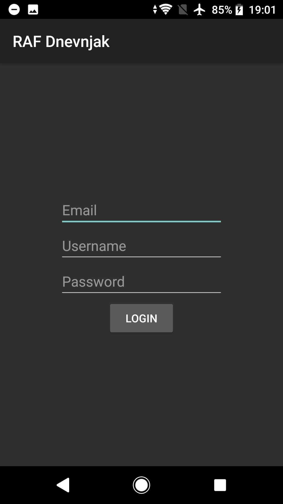
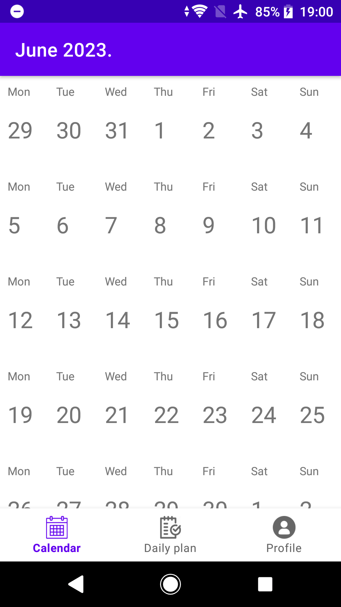
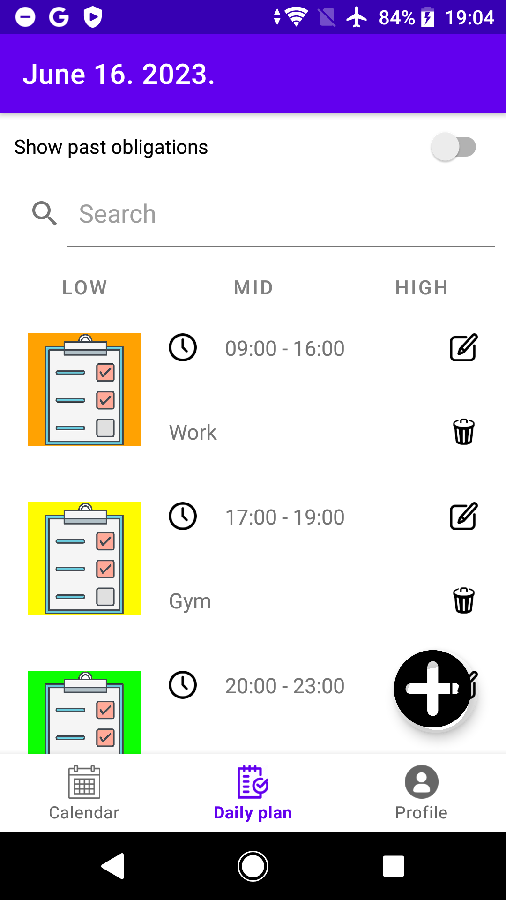
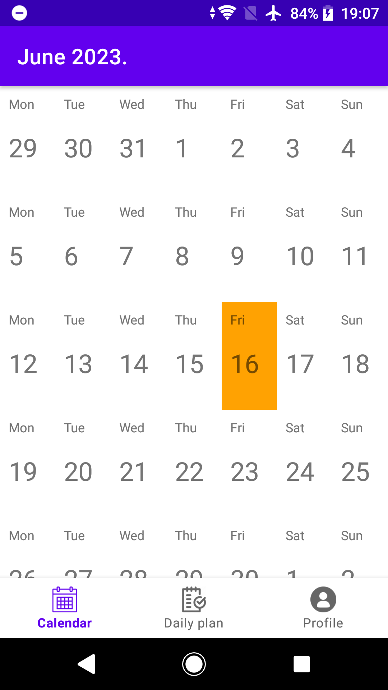
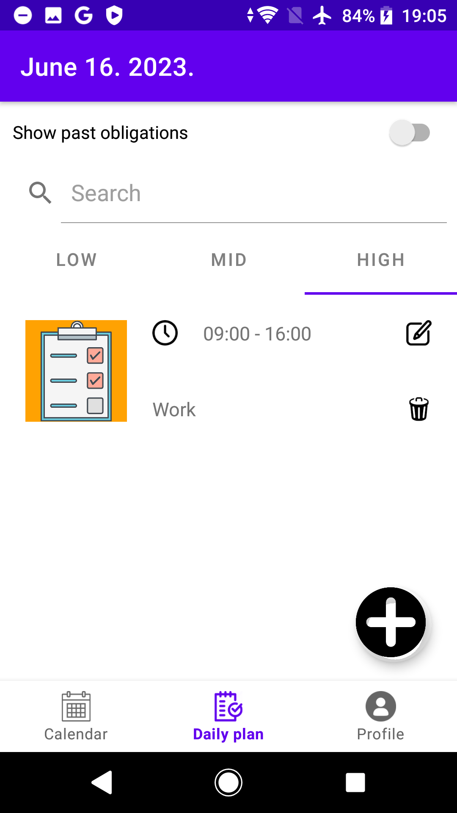
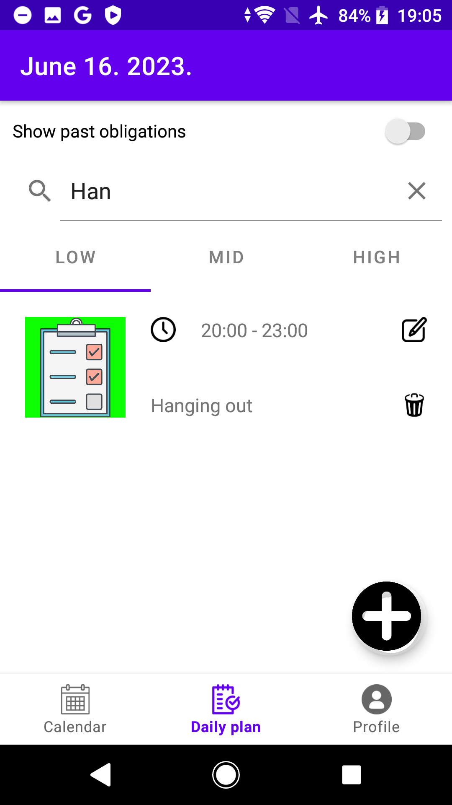
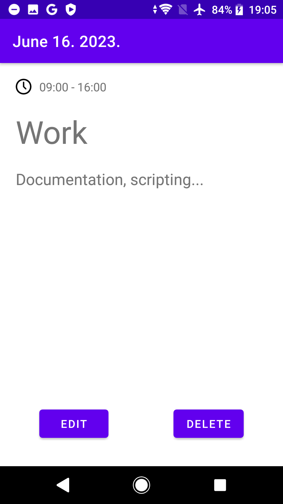
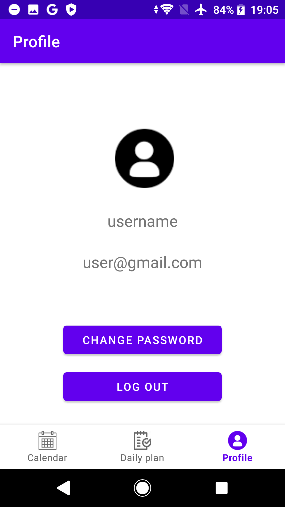
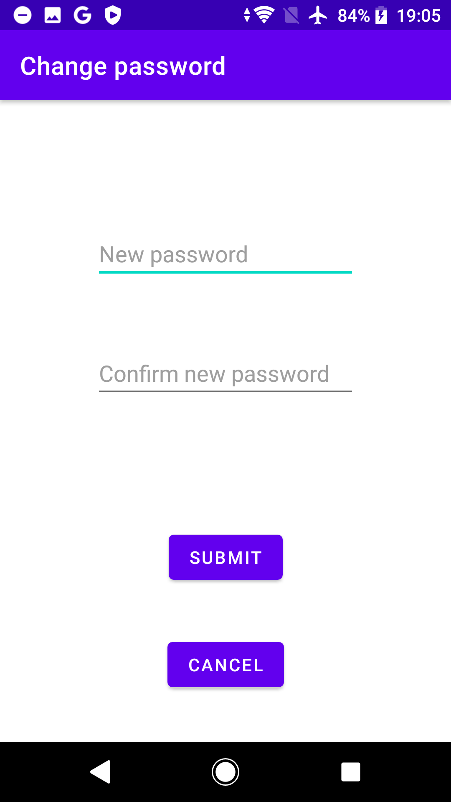

# RAF-Dnevnjak

This was a colloquium project for uni. The app is supposed to be used for organizing chores using a calendar.

When first run, the app will go to a login screen, there is only a default user with the credentials (username, username@gmail.com, A1234).
The login screen has validations for parameters such as the password needs to contain at least one upper case letter and have 5 characters at least...
After the login the calendar will be open to the current month. By scrolling up/down the calendar will dynamically load up previous/next months.
On the top of the screen you will see which month and year you're looking at. On the bottom you will see three buttons from which one is active (Calendar).
The second button is the daily plan which can be only accessed by clicking on a day in the calendar, and the third button is the profile.
In the profile tab you can log out, or change the password (works only while the app is running, when the app is shutdown the memory is wiped and reset
to the old account already mentioned). When changing the password the old and new password must differ and the new password and its confirmatiom must match.

When we click on a day in the calendar a daily plan screen will show up. At the top you can select to see passed obligations (which aren't showed otherwise, 
this is also a reason why you might not be seeing obligations when you add them to past dates). Below it is a search bar and a filter with threee buttons to 
show only obligations with low,mid,high severities. If clicked on again the list will show all obligations. Near the bottom on the right side of the screen you
will see a + button which is used for adding obligations. The obligation contains it's severity (low/mid/high), a title, description and time which must be
reasonable and must not overlap other activities. When created it will show up in the obligations list in the daily plan, you can click on it for the detailed
view. You will also see buttons for editing, deleting the obligation. If you go back to the calendar now you will see that the day you added a obligation to has
been colored based on the highest obligation severity that day (if its high it will be orange, mid is yellow and low is green). That's about it, you can explore
a bit more to see how all of this works :).

The original documentation for this project is in the "RAF Dnevnjak - Specifikacija.docx" file.

# The application itself:

## Splash screen:

 
## Login screen:

 
## Calendar:

 
## Detailed date:

 
## Add a obligation to a certain date:

 
## Calendar colours its date based on the most severe obligation that day:

 
## Filter obligations based on their severity:

 
## Search obligations through the search field:

 
## Detailed obligation view:

 
## Edit profile screen:

 
## Change password:

 
